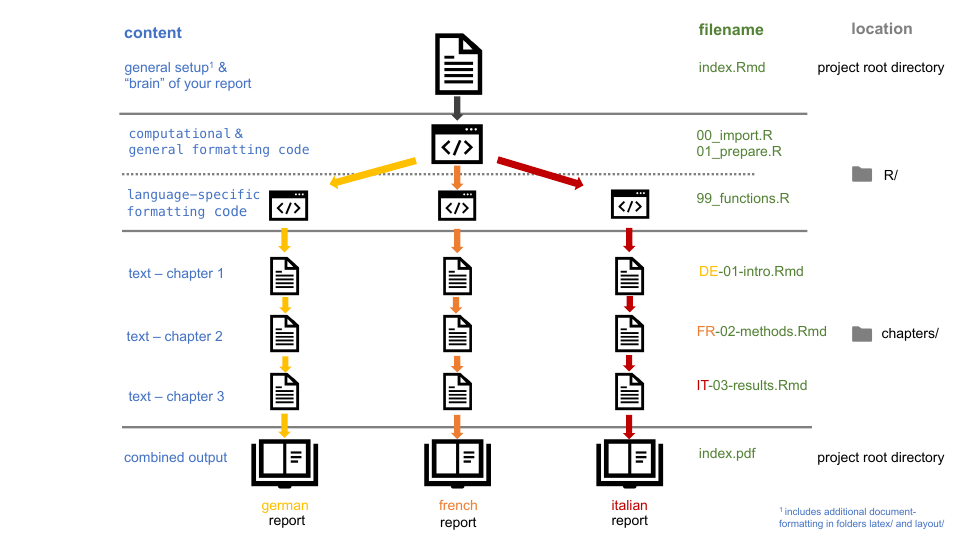

<!-- README.md is generated from README.Rmd. Please edit that file -->

```{r, include = FALSE}
knitr::opts_chunk$set(
  collapse = TRUE,
  comment = "#>"
)
```

<!-- badges: start -->
<!-- badges: end -->

# Template for parametrised reporting at INS

This repo holds a draft version for parametrised reports in Rmarkdown.  

Parameter features (the things that can be changed) include for now:  

 - center # this can actually be changed to whatever setting your are working on
 - language (allows for reporting in several languages for same center, important for bilingual cities)
 - restrict_level (if pct-agreement per answer should be restricted if less than X answers were given per group to protect respondents) 
 
 Other features include:  
 
 - Logo in header 
 - inclusion of Cover page from external pdfs 
 - switch from `rmarkdown::pdf_document` to `bookdown::pdf_document2`allows cross-platform editing (windows, mac and linux users) without the encoding-snafu  
 
 
## How to use it? 
 
The easiest is to fork/clone or download this repo and start working locally. 

## How does it work?  
 
 *section is work in progress*
 
 In general, parametrised reports have usually the same structure, layout, linguistic 
 and computational background, but depending on the parameters some of these properties 
 may change (the results of computation change every time - that's the idea of 
 parametrised reports).  In our case the main change driven by the parameter language 
 affects the linguistic and some layout properties (i.e. affecting everything captured 
 in text not in numbers). In very rare cases the structure changes based on the 
 underlying data; e.g. if a center does not have more than one unit, there is no need to 
 add "per unit" results on a different page, thus this past should be omitted.  
 
 This graph provides a overview of the workflow when knitting the index.Rmd-
 file. The computational code stays the same (i.e. the cell-content of the tables is 
 dependent by the parameter 'center', but the computation stays the same). General 
 table formatting (such as `kableExtra::kable()` and `kable_styling()`) remains the 
same, too.  
But depending on the parameter 'language', styling/text of table headers changes and 
different text files used to be stitched together as the report.  


 
 The main file to use in production is `index.Rmd` which will - when configured 
 properly - output a file called `index.pdf` in the language defined in the params-section.  
 
 The graph is  draft and should serve to support the main idea behind these 
 reports. It is neither complete nor exclusive and feedback is welcome.  
 
## Contributions welcome 👋
 
 Have an idea for the better? File an issue or start a PR - thanks. 
